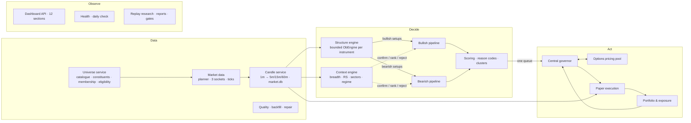

# Multi-market order-block platform — architecture, operation and results

This is the as-built documentation for the platform specified in
[`PLATFORM_PLAN.md`](PLATFORM_PLAN.md). The plan holds the audit, the
design rationale and the schemas; this file covers what exists, how to run
it, what was measured, and what is still missing.

**Paper only.** `execution.mode` accepts only `"paper"`. The boundary is the Kite
client itself, not the SDK import (the SDK is needed for market data):
`data/kite/readonly.py` wraps every `KiteConnect` the platform builds in
`ReadOnlyKite`, which exposes only a whitelist of read methods (instruments,
quote, ohlc, ltp, historical data, profile, margins, session setup). Every
order, GTT, position-conversion, MF and token-revocation method raises
`PaperOnlyError` before it reaches the SDK, and the wrapper cannot be
unwrapped or reassigned. `tests/test_paper_boundary.py` checks that every SDK
method is classified, that order calls never reach the client, that
`KiteConnect(` is constructed only in `rest.py`/`auth.py`, and runs backfill,
option pricing and the desk end to end against a spy client to show only
whitelisted methods are called. Live trading would need a separate,
deliberate project.

> **The rule.** Every trade originates from a valid order-block setup.
> Bullish and bearish pipelines share one documented core methodology and
> differ only in their direction-specific rules. Other indicators and market
> data may confirm, rank or reject a setup, but they never generate a trade.

How the rule is enforced in code:

- A `SignalCandidate` can only be built by `signals.shared.from_setup()`, from a
  structure-engine `setup` event whose zone direction matches the pipeline.
  Anything else raises `OriginError`.
- A source scan proves there is no other construction site.
- A runtime test proves every stored signal joins to a stored zone.

---

## 1. Architecture



| Module (plan §4) | Package | Notes |
|---|---|---|
| M1 Universe | `market_platform/universe/` | `catalogue.py`, `constituents.py`, `membership.py`, `eligibility.py`, `lots.py`, `service.py`, `calendar.py` |
| M2 Market data | `market_platform/marketdata/` | `planner.py` (tiers, 3 × 3,000 budget, diffs), `pool.py`, `bus.py`, `stream.py` (DataPlane) |
| M3 Candles | `market_platform/candles/` | `service.py` (completion contract), `volume.py` (index volume proxy), `backfill.py`, `quality.py` |
| M4 Structure | `market_platform/structure/engine.py` | the NIFTY `ObEngine`, one per instrument, bounded with absolute-index rings (`model/order_blocks/ring.py`) |
| Context | `market_platform/context/` | `engine.py` (breadth, RS, trends, volatility, regime), `correlation.py` (clusters, beta) |
| M5/M6 Bullish / Bearish | `market_platform/signals/` | `shared.py` (contract + methodology), `bullish.py`, `bearish.py`, `pipeline.py` (separate tasks + queues) |
| M7 Scoring | `market_platform/scoring/` | `reasons.py` (stable codes + explanations), `score.py` (filters, score parts, statuses, clustering) |
| M8 Risk | `market_platform/risk/` | `governor.py` (§7.2 order), `desk.py` (single approver queue) |
| M9 Options | `market_platform/options/` | `routes.py`, `pricing.py` (process pool + deadline), `chains.py` (Kite ladders, archive replay) |
| M10 Paper execution | `market_platform/execution/` | `paper.py` (fills, gaps, exits, restart-safe), `costs.py` (per segment) |
| M11 Portfolio | `market_platform/portfolio/book.py` | exposure map, the four counts, MTM, restore |
| M12 Research | `market_platform/research/` | `replay.py`, `report.py`, `baseline.py` (nifty-ob-v1), `cli.py` |
| M13 Persistence | `market_platform/persistence/` | `db.py` (WAL, migrations with checksums), `writer.py`, `runs.py`, `legacy.py` |
| M14 Health | `market_platform/health/`, `api/` | `load.py` (harness), `daily.py` (Phase 9 check), dashboard health |

**Concurrency.** The platform is a modular monolith on a single asyncio loop.
- **Bus.** Tasks talk over an in-process bus (`marketdata/bus.py`). Every queue is bounded, and each subscriber has an explicit overload policy:
  - `block` (backpressure) for candles → structure, structure → pipelines and signals → desk;
  - `drop_oldest` for consumers that only need the latest state.
- **Writers.** Each database has one writer task, which batches commits in a worker thread.
- **Pricing.** Option pricing runs in a process pool under a deadline.
- **No Kafka or Redis.** Everything runs in one process, every event can be re-derived from `market.db`, and the audit trail is in SQLite (plan §3.2).

**Determinism and reproducibility.**
- A signal id is a hash of (instrument, direction, zone, setup type, trigger time, strategy version).
- Every run records its config hash, strategy version, universe snapshot and data version (`runs`).
- Signals, decisions and positions are keyed per run, by `(run_id, signal_id)` (migration 0003).

## 2. Methodology

### 2.1 Shared order-block core (unchanged from the validated NIFTY engine)

- **Structure.** Confirmed k-pivots, with BOS/CHoCH decided on closes.
- **Displacement.** A displacement leg must break structure within 6 bars.
- **Source candle.** The last opposing candle at or before the leg origin.
- **Zone.**
  - Trimmed or rejected by ATR width.
  - FVG and liquidity sweep are recorded as confluence.
  - Lifecycle: ACTIVE → TOUCHED → TRIGGERED / INVALIDATED / EXPIRED / CONSUMED.
- **Intraday trigger.** A 5m CHoCH after a 15m zone touch, inside the direction's window.
- **Overnight candidate.** The 15:15 close inside or beyond the zone, with the 60m trend not against it.
- **Plan.** Stop beyond the zone plus a buffer; target at the nearest opposing liquidity (swing, then prior day, then 2R).
- **Core score.** 0–100: structure, displacement, volume, sweep, FVG, HTF trend, freshness, tightness.

`params_from_config(default config)` has the same fingerprint as `ObParams()`.
On the same bars, the platform's pipelines produce exactly the NIFTY engine's setups:
`TestNiftyBaselineEquivalence`, `TestReplay.test_nifty_baseline_reproduced_exactly`.

### 2.2 Direction-specific rules

| | Bullish (`signals/bullish.py`) | Bearish (`signals/bearish.py`) |
|---|---|---|
| Zone | last red/doji candle at the leg low before a BOS/CHoCH up | last green/doji candle at the leg high before a BOS/CHoCH down |
| Volume | up-volume share of the impulse leg ≥ `min_directional_volume_share` | down-volume share ≥ threshold **and** ≥ 50% of leg bars close in the lower third |
| Relative strength | RS vs benchmark over 5 and 20 sessions > 0; vs sector reported | both < 0 (relative weakness); vs sector reported |
| Structure | HH + HL | LH + LL |
| Context | alignment −1…+1, scored (±5), never auto-reject | same |
| Gap | open > zone_high + 1 ATR → `GAP_AWAY` | open < zone_low − 1 ATR → `GAP_AWAY` |
| Routes | equity: cash MIS (intraday) / CNC (overnight), long future, CE (F&O); index: future / CE | equity intraday: MIS short, short future, PE; **overnight: F&O only** (short future / PE); index: future / PE |

A bearish **view** is always recorded. If no route is allowed, for example an overnight short on a stock without F&O, the status is `NOT_EXECUTABLE` and the reason says why.

### 2.3 Scoring, filters and clusters (`scoring/score.py`)

**Mandatory filters.** Each failure sets the status to `REJECTED` with a reason code:
`STOP_INVALID`, `RR_BELOW_MIN`, `OUTSIDE_WINDOW`, `GAP_AWAY`, `DATA_QUARANTINED`, `DATA_STALE`, `NOT_IN_UNIVERSE`, `LIQUIDITY_THIN`, `SPREAD_WIDE`.

**Score.** The core score plus bounded, transparent adjustments, clipped to 0–100:

| Part | Adjustment |
|---|---|
| Volume | ±5 |
| RS | ±5 |
| Structure | ±3 |
| Context | 5 × alignment |

**Status.** By score: `QUALIFIED` ≥ 75, `WATCH` ≥ 60, otherwise `REJECTED` (`SCORE_LOW`).

**Clusters — deterministic allocation (time, then merit).** Signals with the same direction, in the same 15-minute window and the same correlation cluster (falling back to sector, then instrument) share a `cluster_id`, and at most `max_signals_per_cluster` keep `QUALIFIED`:
- Earlier minutes win: a slot taken at 10:01 is not given back to a better signal at 10:07 (no look-ahead).
- Within one minute, every candidate of that minute is ranked together by `(-score, -R:R, -ADV, instrument_key)`, never by arrival order. The pipeline collects the whole minute before allocating, and the desk waits for both directions' minute batches (a per-minute barrier) before deciding, in `(available_at, -score, -R:R, direction, instrument_key)` order.
- Losers become `SUPPRESSED:CLUSTER_CAP` and stay visible; each signal stores `allocation` (`cluster_id`, rank this minute, candidates/kept this minute, slots taken before) in `score_json`.
- Tests shuffle candidate order and inject random publish jitter into the live bus tasks; winners and desk decisions are identical to replay.

### 2.4 Risk and execution

**Governor (`risk/governor.py`).** It is the sole approver and fails closed. Checks run in plan §7.2 order:
1. Platform: kill switch, calendar, feed, data quality.
2. Metadata: route, lot as of the date, expiry.
3. Executability, including option pricing.
4. Geometry.
5. Liquidity.
6. Portfolio:
   - duplicates;
   - positions, strategy and cluster counts;
   - daily loss including MTM;
   - consecutive losses;
   - entries per session.

**Sizing.**
- **Budget.** Equity × tier %, capped by the headroom left under the aggregate, sector, underlying, cluster and overnight caps. `bound_by` records which cap bound.
- **Per-unit loss, on stress:**

  | Position | Per-unit loss |
  |---|---|
  | Intraday | stop distance + slippage band |
  | Overnight cash / futures | stop × (1 + `overnight_gap_stress_mult`) + band |
  | Options | premium to the option stop (intraday); full debit (overnight) |

- **Lots.** Rounded down, then capped by the order-value, premium-deploy and ADV-participation ceilings.
- **Costs.** Round-trip costs must stay ≤ `max_cost_frac_of_reward` of the reward.

**Desk (`risk/desk.py`).** One queue fed by both pipelines, so the governor is the only place exposure changes. No double allocation is possible; `TestConcurrency` checks this with 80 simultaneous signals.

**Paper fills (`execution/paper.py`).**
- **Entry fills**, in order of preference: depth walk; top of book; LTP ± slippage; signal price ± slippage (replay only).
- **Stale books** get a penalty.
- **Gap through the stop** at the open exits at the open, and `gap_pnl` records the extra loss.
- **Stop and target in the same bar** → the stop is assumed.
- **Time exits:** 15:15 for intraday, 10:30 the next session for overnight.
- **Restart safety:** orders are unique per (run, signal, purpose, leg, attempt).

**Costs (`execution/costs.py`).** Equity CNC/MIS, futures and options schedules, read from `[costs]` with an `as_of` label.

## 3. Data

**Universe.**
- `conf/universe/index_catalogue.csv` lists 28 indices: broad, sector and thematic.
- Kite tokens and derivative underlyings come only from the master. A candidate underlying is set only when NFO/BFO lists futures for it.
- Constituents come from niftyindices CSVs, which are ISIN-keyed and use `Industry` as the sector.
- BSE indices are loaded from manual files in `conf/universe/constituents/` (see §6, limitations).
- Membership is versioned (`valid_from` / `valid_to`), so the members on a given date can be queried.
- Snapshots are content-addressed.
- **Downloads are validated and fail closed (`universe/validate.py`).** A file is applied only if it passes: non-empty, member count within the catalogue's `expected_members`, ISIN check digits (ISO 6166), no duplicate symbol/ISIN, churn vs current membership ≤ 20% (broad) / 40% (other); and cross-index identities (NIFTY 50 ⊂ 100 ⊂ 200 ⊂ 500, NEXT 50 ⊂ 100, 50 ∩ NEXT 50 = ∅, 50 ∪ NEXT 50 = 100, MIDCAP 150 / SMALLCAP 250 ⊂ 500). Series other than EQ/BE and a symbol whose ISIN changed (symbol change / corporate action) are warnings. A rejected or missing file keeps the previous membership in force and is recorded in `index_refresh`.
- **Readiness.** `run` refuses to start (exit 2) if any index was never validated, its latest refresh was rejected or missing, its last good list is older than `universe.max_membership_age_days` (7), or coverage < 99%. `universe.allow_stale = true` lets it start anyway, and the run is labelled `STALE_UNIVERSE`. `universe validate` prints the state.
- Instruments are deduplicated by token.

**Lots.** There is no lot table in the code; a grep test enforces this. Lots for any underlying come from the front future in the Kite master, as of the date: all NFO/BFO futures are now versioned in `kite_instrument_history`.

**Subscriptions.** The plan's §6.2 tiers apply. Equities use `full` mode by default, because `quote` packets carry neither an exchange timestamp nor depth.

**Candles.**
- A minute settles at minute end + 5 s grace. A 1 s clock settles illiquid names.
- `available_at` is never earlier than the bar end.
- HTF bars come from the same `BarBuilder` that replay uses: live equals replay, bit for bit (test).
- A WebSocket bar never overwrites a REST bar.
- Each instrument's first bar after a restart has volume = NULL and is queued for REST repair.

**Index volume.** An index has no traded volume, so the core uses the front future's volume (`candles/volume.py`). Live and replay share the join function.

**Backfill / repair / quality.**
- Backfill is resumable through watermarks and capped by a request budget.
- Gap repair re-fetches from REST.
- Per-instrument quality checks cover coverage, OHLC, jumps (unless a corporate action is recorded), holiday bars and out-of-session bars.
- A quality report blocks (exit code 3) when an index is critical or more than 5% of equities are.

## 4. Running it

```bash
# once
pip install -r requirements.txt                 # adds fastapi + uvicorn for the dashboard
export KITE_API_KEY=... KITE_API_SECRET=...     # or .env (never commit secrets)
python model_cli.py kite-login                  # daily (sessions expire 06:00 IST)
python model_cli.py kite-master --exchange NSE --exchange NFO --exchange BSE --exchange BFO
python platform_cli.py init                     # data_store/app.db + market.db; imports legacy NIFTY data
python platform_cli.py calendar import nse-holidays-2026.csv --exchange NSE   # exchange holiday list
python platform_cli.py config check

# universe (BSE: put conf/universe/constituents/bse_sensex.csv first — §6)
python platform_cli.py universe refresh         # exit 1 if any index rejected, missing or < 99% resolved
python platform_cli.py universe validate        # readiness: what `run` would refuse and why
python platform_cli.py universe coverage
python platform_cli.py universe tree

# history
python platform_cli.py data backfill --days 365 --max-requests 3000   # resumable; re-run to continue
python platform_cli.py data quality --from 2026-01-01 --to 2026-10-09

# research (bars only; option routes need archived quotes)
python platform_cli.py backtest run --from 2025-10-01 --to 2026-09-30 [--index "NSE:NIFTY BANK"] \
        [--direction bullish|bearish|both] [--horizon intraday|overnight|both]
python platform_cli.py backtest report RUN_ID            # development only; --unseal shows the holdout (logged)
python platform_cli.py backtest compare-nifty RUN_ID --from ... --to ...
python platform_cli.py backtest sensitivity --from ... --to ... --mults 1,2,3

# live paper session (09:00–15:35 IST)
python platform_cli.py run                      # warms structure from stored bars, then streams
python platform_cli.py dashboard                # http://127.0.0.1:8765 (read-only)
python platform_cli.py daily-check              # after the close: quality, coverage, reconcile, health
python platform_cli.py kill [--release]         # paper kill switch (shared with ob-kill)

# performance
python platform_cli.py load-test --tokens 1500 --minutes 16 --mult 1,2,4
```

**Report bases — underlying vs options are never mixed.** `backtest report` prints two labelled sections:
- **UNDERLYING** (`research/underlying.py`): every signal the scorer QUALIFIED (its first status, before the governor) walked on the instrument's own 1m bars with the NIFTY simulator, costs in index points / equity bps. It measures whether the order-block signals predict the underlying, needs only candles, and drives **Gate A**.
- **EXECUTED**, split by route basis: `equity (cash)`, `futures (modelled from underlying + costs)`, `options (archived real quotes)`. Option P&L exists only where an archived quote snapshot priced the trade. `options_coverage` reports priced / unevaluable; below 70% coverage or too few priced trades the options basis is printed as **NOT ASSESSABLE**, and Gate B is not claimed on it. History without archived option quotes therefore validates the underlying only.

**Cron (IST) suggestion:**

| When | Job | Command |
|---|---|---|
| 08:45 | refresh master | `kite-master` |
| 08:50 | refresh universe | `universe refresh` |
| 09:05 | start the session | `run` (it stops itself at 15:35) |
| 16:00 | incremental history | `data backfill --days 5` |
| 16:30 | daily validation | `daily-check` |

The existing `scripts/ob-cron.example` NIFTY jobs keep working unchanged.

**Where things are:**
- `data_store/app.db`: config versions, runs, universe, zones, signals, decisions, orders, fills, positions, snapshots, health.
- `data_store/market.db`: bars, option quotes, quality events, watermarks.
- `reports/`: `quality/`, `backtests/`, `daily/`, `load/`.

## 5. Configuration and monitoring

- **Configuration.**
  - `conf/platform.toml` holds every key; `config describe` lists each key's type, default and range.
  - The config is validated at load: unknown keys, wrong types, out-of-range values and inconsistent limits all refuse to start.
  - Its hash is stored in `config_versions` and on every run.
  - The dashboard's Configuration tab validates a TOML change without saving it.
- **Promotion criteria.** These live in `conf/promotion.toml` and are pre-registered: change that file only in its own commit, before looking at the results it would judge.
- **Health.**
  - States are derived from data, not process liveness. During a session, the feed is DEGRADED when the newest bar is older than `data.stale_after_sec`, even if every process is up; this is tested.
  - Health rows cover the planner, the market writer, candles and each pipeline.
  - The dashboard's System Health tab and `daily-check` summarise them.

## 6. Test, load and recovery results

`python -m unittest discover -s tests`: **591 tests, all passing; `ruff check .` is clean.**

| Suite | Tests | Covers |
|---|---|---|
| `test_platform_phase1` | 15 | config validation, migrations and checksums, writer batching/backpressure/isolation, legacy import, calendar, runs |
| `test_platform_phase2` | 24 | catalogue, constituents, versioned membership and point-in-time queries, dedupe by token, eligibility, lots from the master (by date), no hardcoded lots, breadth shim, CLI |
| `test_platform_phase3` | 19 | planner tiers/budget/eviction/diffs, bus policies, pool, candle completion, **replay equivalence bit for bit**, restart without duplicates, 1,500-instrument throughput, backfill watermarks, repair, quality gate |
| `test_platform_phase4` | 25 | bounded core equals unbounded, flat memory, OB-origin enforcement (runtime and source), **NIFTY baseline equivalence**, determinism, direction rules, pipeline isolation, scoring, clustering, context, correlation, live bus routing, **cluster allocation independent of processing order (shuffle + live jitter = replay)** |
| `test_platform_phase5` | 22 | costs, routes, governor checks/sizing/caps, options pricing (index and stock, deadline, process pool), chain providers, fills/gaps/exits/P&L, restart mid-trade, **concurrency (no double allocation)**, paper isolation (AST) |
| `test_platform_phase6` | 11 | replay through the same modules, no look-ahead, unavailable option data → unevaluable, sealed holdout, gates, **nifty-ob-v1 reproduced field by field (zones, setups, decisions, exits)**, a changed strategy is detected, underlying vs options bases, point-in-time membership, determinism, slippage sensitivity |
| `test_paper_boundary` | 5 | every SDK method classified, order methods blocked before the client, only `rest.py`/`auth.py` construct `KiteConnect`, end-to-end backfill + option pricing + desk use only read methods |
| `test_universe_validation` | 8 | ISIN check digit, count/duplicate/churn/symbol-ISIN checks, cross-index identities, truncated or inconsistent file rejected with the old list kept, missing/stale/allow_stale, runner refuses an unready universe |
| `test_platform_phase7` | 8 | 12 sections, explanations, chart data, read-only connections, config validation, **5,000 signals < 300 ms**, health DEGRADED on a silent feed |
| `test_platform_recovery` | 7 | WS drop → REST repair, DB locked and disk errors, **kill -9 mid-session → same later signals, no duplicate orders**, duplicate ticks and candles, missing candles, feed down → nothing approved |
| `test_platform_phase8` | 3 | live paper runner end to end, load harness, daily reconciliation (0% mismatch) |

**Load (measured, `load-test --tokens 1500 --minutes 16 --warm-sessions 25`, one core, synthetic ticks with depth through the real live path).** Every instrument's structure state is first warmed with 25 sessions of 1m bars (14 M bars), so the rings are full and the numbers reflect steady state:

| Load | Ticks | Ingest capacity | Headroom | Candle completion p99 | All-instrument structure + signals + risk p99 | Process RSS after warm-up → end | Peak RSS | Writer |
|---|---|---|---|---|---|---|---|---|
| 1× (1 tick/token/s) | 1.44 M | 140k ticks/s | 94× | 5.06 s | 0.56 s | 794 → 828 MB | 828 MB | 24k rows, 0 dropped, 0 backpressure |
| 4× | 5.76 M | 134k ticks/s | 22× | 5.07 s | 0.58 s | 794 → 826 MB | 826 MB | same |

All §9.6 SLOs that the harness measures are met at 4× (targets: completion ≤ 7 s, structure ≤ 1 s, ≥ 2× tick rate).

**Memory, three separate figures.**
- *Process RSS / peak* (VmRSS / VmHWM from `/proc`): about 81 MB at start, **≈ 830 MB at 1,500 instruments** in steady state, flat across the timed session.
- *Structure state per instrument*: **≈ 486 KB** (RSS delta of the warm-up ÷ instruments; 713 MB for 1,500). This is the bounded per-instrument engine state (1m/HTF rings, swings, zones) and the bulk of the process.
- *Everything else* (bus, candles, scoring, desk, writer, interpreter): ≈ 115 MB.
- The earlier "58 MB" was a tracemalloc figure for a session with **no warm-up**: the rings held only the 16 test minutes, so it measured a nearly empty engine, and tracemalloc counts Python allocations, not RSS. tracemalloc also slowed the hot path ~3× (the earlier 22× / 1.9 s figures); it is no longer used in the harness.

The writer measured on its own does **108k rows/s** (90k bar rows in 0.83 s); one minute of 1,500 bars commits in about 10 ms.
**Caveat:** inside the harness the writer's commit latency reads 12–38 s, because the synthetic generator keeps the
event loop and the GIL busy for the whole minute and the writer only gets scheduled between bursts (nothing was dropped and no
backpressure occurred). A live socket spends most of its time waiting on network I/O, so this does not apply to real sessions,
but it should be checked in the first paper sessions (`daily-check` health rows). The soak test (memory flat over 6 h) and the
dashboard p95 test with live writes still have to be run during the paper period.

## 7. Limitations and open items (honest)

**Evidence**
- **No edge is established.** Everything here is tested on synthetic data. Before any pipeline is trusted, it needs:
  - Gate A/B on real history (`backtest report`);
  - the paper shadow period (`daily-check`, ≥ 20 sessions).
- **History before the first universe snapshot is survivorship-biased** unless historical membership is imported (`universe import-history`); reports label it.

**Data sources**
- **BSE constituents** (SENSEX, BANKEX) need a manual CSV, because BSE has no stable file to fetch.
- **niftyindices URLs** are taken from the published pattern, but the sandbox could not reach them (403), so validation is tested on fixtures in the published layout with real ISINs. The first `universe refresh` on your machine is the real test; a failed, truncated or inconsistent file is rejected, the previous list stays in force, and `run` refuses to start until it is fixed or `allow_stale` is set.
- **Corporate actions** are not fetched automatically: fill `corporate_actions` yourself. Daily bars are unadjusted, so jumps on split days are flagged unless the action is recorded.

**Options and execution**
- **Option ladders** are priced from REST quotes at decision time, and each snapshot is archived. Index ladders are not yet streamed (tier T4) and on-demand stock ladders (tier T5) are not wired; the planner supports both.
- **Stock options.**
  - The volatility input is the ATM implied vol.
  - Overnight option positions are sized on the full debit. That is conservative, but stock-option stress has not been calibrated the way NIFTY's was.
- **Not modelled:**
  - DP charges;
  - freeze-quantity slicing for very large stock orders (`freeze_qty_default` exists; per-symbol freeze limits are not in the master).
- **Index volume proxy.** It uses the nearest-month future present. On roll days, live (T1 contract) and replay (nearest month in the stored bars) can disagree if both months were recorded; `daily-check` would show it.

**Engine and context**
- **The first bar after a restart** has NULL volume until REST repairs it (two minutes later). HTF bars that include it carry the partial volume live; replays read the repaired value.
- **Regime and alignment** are transparent heuristics, not fitted models. Correlation clusters need at least 20 sessions of daily bars.
- **Memory:** about **486 KB per instrument** of structure state, flat once the rings fill: ≈ 830 MB process RSS at 1,500 instruments (≈ 360 MB at 500). This is over 3× the plan's 150 KB target; the old engine grew without bound (A5). Shrinking it (e.g. compact bar arrays instead of per-bar objects) is open work; it is not needed for a machine with ≥ 2 GB free.
- **Not enabled:** the plan's extra trigger types (breakout-retest, sweep-reclaim) and gap-down continuation. Each would be a new setup type, and under the rule it must be deliberately introduced and validated separately, not slipped in.

**Operations**
- **Kite sessions expire at 06:00.** A session cannot re-login by itself; after `kite-login`, restart `run`.
- **The dashboard has no authentication** and binds to 127.0.0.1. Expose it only behind your own access control.

## 8. Baseline comparison procedure (expanded vs `nifty-ob-v1`)

1. Make sure `market.db` has NIFTY 50 spot and front-future 1m bars for the window.
   - `platform_cli.py init` imports the NIFTY system's archive.
   - Otherwise run `data backfill`.
2. Run the platform: `backtest run --from A --to B`. It covers the whole universe, both directions and both horizons.
3. Run `backtest compare-nifty RUN --from A --to B`. It replays the original engine on exactly the bars the platform used (NIFTY 50 spot + front-future volume, same timestamps) with the parameters taken from the run's own stored config, and compares field by field:
   - `config`: parameter fingerprint of the run vs the baseline;
   - `zones`: every zone's timeframe, direction, kind, source/BOS/eligible timestamps, bounds, ATR, displacement, RVOL, FVG, sweep, final status and close reason;
   - `setups`: trigger time, `available_at`, horizon, entry, stop, target, HTF trend, core score and each component;
   - `decisions`: the core eligibility decision and its rejection reason (`SCORE` / `RR`);
   - `exits`: for every setup, entry/exit time and price, exit reason, R and gap R.
   **`identical` must be true; otherwise the platform changed the NIFTY strategy, the differences are listed, and the command exits 1.** Not compared, by design and reported separately: the platform's extra filters (context, liquidity, clusters, governor) and therefore which trades get taken. Also printed: the baseline's own metrics, the platform's results for all instruments and NIFTY only, and NIFTY buy-and-hold.
4. Judge expansion only on the development sessions, by the gates in `conf/promotion.toml`. The holdout stays sealed until a single, logged `--unseal`.
