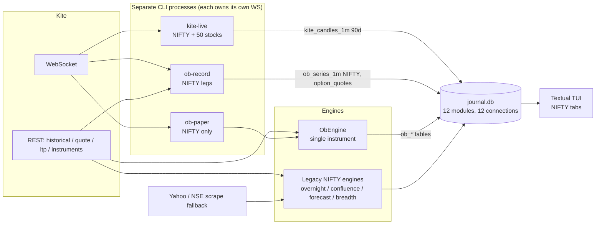
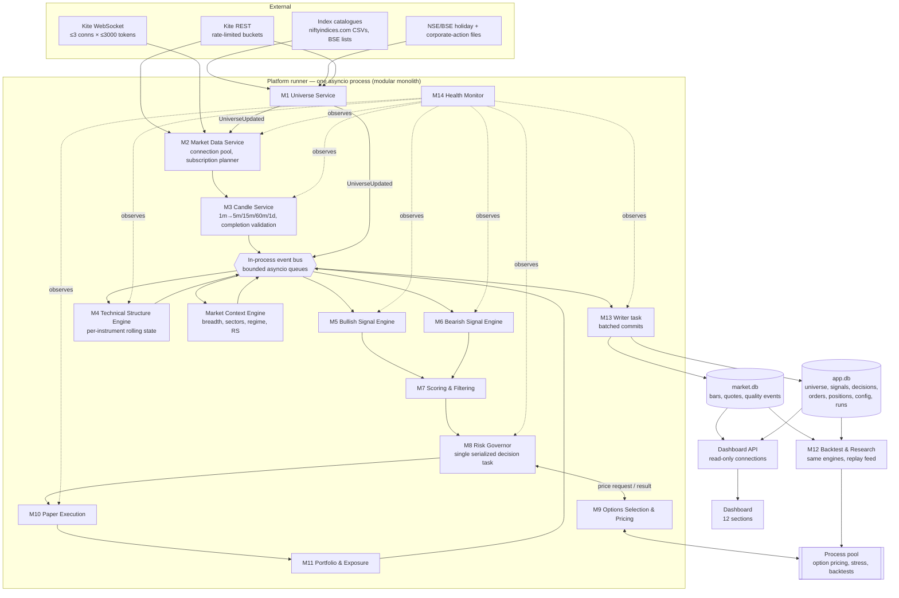
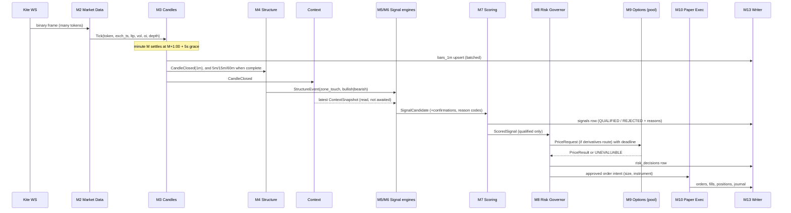
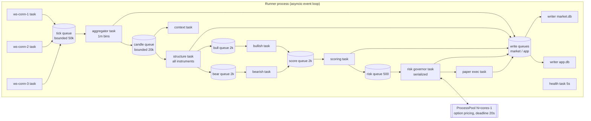
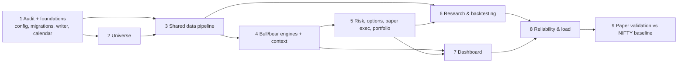

# Multi-market order-block platform — audit and implementation plan

Status: **implemented (Phases 1–8; Phase 9 is the paper observation period you run).**
The as-built documentation, run instructions, measured results and open items are in
[`PLATFORM.md`](PLATFORM.md); deviations from this plan are listed there (§6–§7).
Branch: `claude/dreamy-hypatia-em8x55` (on top of `feature/laya-filter`).
Execution stays **paper-only**. This plan contains no live order path. Enabling one would need a separate, deliberate project.

The governing rule, from the brief, is enforced by structure rather than by convention:

> Every trade originates from a valid order-block setup. Bullish and
> bearish pipelines share one documented core methodology with
> direction-specific rules. Other indicators and market data may
> confirm, rank or reject a setup, but never generate a trade.

In code, only the Technical Structure Engine creates zones. The signal engines can only create a candidate from a zone event. Context, breadth, relative strength and volume can attach evidence, change a rank, or reject. Nothing else has a code path that produces a candidate. A test enforces this (§9.2).

---

## Contents

1. [Audit of the current repository](#1-audit-of-the-current-repository)
2. [Current-state architecture](#2-current-state-architecture)
3. [Target architecture](#3-target-architecture)
4. [Module breakdown and data flow](#4-module-breakdown-and-data-flow)
5. [Database and event schemas](#5-database-and-event-schemas)
6. [Concurrency and subscription strategy](#6-concurrency-and-subscription-strategy)
7. [Risk controls and failure handling](#7-risk-controls-and-failure-handling)
8. [Phased checklist with dependencies](#8-phased-checklist-with-dependencies)
9. [Testing and performance validation](#9-testing-and-performance-validation)
10. [Known constraints before we start](#10-known-constraints-before-we-start)
11. [Decisions needed from you](#11-decisions-needed-from-you)

---

## 1. Audit of the current repository

### 1.1 What exists

The repository has about 38,500 lines of Python across 36 commits and 444 passing tests. It has three generations of decision engines that share data plumbing:

| Area | Modules | State |
|---|---|---|
| **Legacy NIFTY decision engines** | `model/composite.py`, `regime.py`, `overnight*.py`, `confluence/` (Setups A/B/C), `forecast/` (Stage 1–6 harness), `stock_overnight.py`, `breadth/`, `laya_filter/` | Working. They are NIFTY 50-centric, with their own journals and CLI. Preserve all of them. |
| **Kite data layer** | `data/kite/{auth,rest,ws,protocol,aggregator,candles,store,instruments,chain,eod,parity}.py`, `data/source.py` | Solid. It has its own binary parser, a reconnecting WS client, rate-limited REST, versioned instrument history, a chain builder with IV inversion, and Kite-first routing with a Yahoo fallback. |
| **Order-block system** | `model/order_blocks/*`, `execution/*`, `journal/ob_db.py`, `services/{order_blocks,ob_record,ob_audit,data_quality,reconcile}.py`, `ob_commands.py` | Complete for **one instrument (NIFTY)**. It includes detection, scoring, contract selection, the stress engine, governor, paper broker, backtest with Gate A/B, the quality gate and reconciliation. |
| **Market archive** | `data/kite/archive.py` | `ob_series_1m` (NIFTY spot + FUT1 only), `option_candles_1m` and `option_quotes` keyed by trading symbol. |
| **UI** | `tui/app.py` (Textual, 9 tabs), `ui/terminal.py`, `ui/chart.py`, rich cards | NIFTY-centric. It has no order-block views. |
| **Persistence** | One `journal.db` (SQLite) shared by 12 modules, each opening its own connection | Tables are created with `CREATE IF NOT EXISTS` plus ad-hoc `_migrate()` functions. |

### 1.2 What is reusable as-is

* **WS client, binary parser, tick aggregator.** These are instrument-agnostic and were measured fast (§1.4). The aggregator already enforces exchange-timestamp bins, grace-held emission, dedup, late-drop and session filtering.
* **Instrument master with change-only history.** `data/kite/store.py` already versions metadata. It needs to cover every tracked underlying rather than NIFTY only.
* **Lot resolver** (`data/lots.py`). The design is right (master as of date, fail closed). It is NIFTY-specific today and generalises cleanly.
* **Order-block core** (`swings`, `structure`, `detect`, `lifecycle`, `triggers`, `score`, `exits`, `stress`, `contract`). These are pure functions of bars and are already direction-aware. They become the Technical Structure Engine and the shared core of both signal engines.
* **Paper broker, governor, cost model, kill switch, data-quality gate, reconcile.** These stay correct. They need generalising per segment and per instrument.
* **Backtest harness** (`model/order_blocks/backtest.py`, `model/forecast/evaluate.py`). Gate A/B, matched baselines, holdout, sensitivity and session-block bootstrap carry over. The resampling unit changes from session to session × correlation cluster (§9.5).

### 1.3 Limitations and defects found

| # | Finding | Where | Impact on the platform |
|---|---|---|---|
| A1 | **Universe is hardcoded**: 50 NIFTY names, static weights and sectors, Yahoo symbols | `model/breadth/universe.py` | Must be replaced by a versioned universe service. Breadth and stock-overnight read it today. |
| A2 | **Stock lot sizes are hardcoded** (`LOTS` dict, as of 2026-09-06) | `data/equity_lots.py` | Violates "never hardcode lot sizes". Stock-overnight sizes from it. |
| A3 | **The archive allows only `NIFTY_SPOT`/`NIFTY_FUT1` series** (`SERIES` tuple + check) | `data/kite/archive.py` | Bars for other instruments go to `kite_candles_1m` (token-keyed, pruned at 90 days), so they cannot be backtested later. |
| A4 | **The engine is single-instrument**, and the series name is fixed at construction | `ObEngine(series="NIFTY_SPOT")`, `services/order_blocks.py` | Needs one engine state per instrument plus a scheduler. |
| A5 | **Engine memory is unbounded.** Every TF keeps every bar (`st.bars`), and swings scan the full list | `engine.py`, `swings.py` | 0.8 MB per instrument per 20 sessions measured. At 750 instruments × 250 sessions that is about 7.5 GB per year. It needs rolling windows (zones live ≤ 20 bars, swings ≤ 60 needed). |
| A6 | **One WebSocket per command** (`kite-live`, `ob-record`, `ob-paper`) | `model_cli.py`, `services/*` | Kite allows 3 connections per key. Running all three uses every connection. The platform needs one ingest owner. |
| A7 | **Synchronous SQLite inside the asyncio loop.** `LegRecorder.on_ticks → _persist → commit` runs in the WS callback | `data/kite/legs.py` | Commits block tick processing. That is fine for 90 legs, but at 2,000+ tokens a slow disk or a lock stalls ingest. |
| A8 | **12 modules open separate connections to one DB file** without WAL or busy timeouts | `journal/*`, `data/kite/*` | Concurrent writers will hit `database is locked` under load. |
| A9 | **Option pricing is CPU-heavy and synchronous**: about 1–5 s per setup (Monte Carlo EV over 1,500 draws × structures × expiries) | `contract.select_contract` | With many setups at 15:15 the decision window (15:15–15:25) would be missed. It needs a process pool with a deadline. |
| A10 | **Risk configuration is spread over five places**: `config.Settings`, `GovernorLimits`, `ContractRules`, `CostModel`, `ObParams` | various | Inconsistent limits are possible. The brief requires one validated config. |
| A11 | **The cost model is options-only** | `execution/costs.py` | Equity intraday, delivery and futures have different STT, stamp and exchange charges. Bearish cash shorts need intraday-equity costs. |
| A12 | **No exchange calendar.** Weekdays are assumed in the roll rule, next-open and DTE buckets | `backfill.py`, `stress.py`, `backtest.py` | Holidays shift sessions, expiries and gap horizons. |
| A13 | **No corporate-action handling** | — | Splits and bonuses create fake gaps and broken zones. Kite's adjustment behaviour for minute history must be verified (§10). |
| A14 | **The direction model is symmetric.** Bearish logic is the mirror of bullish | `detect.py`, `triggers.py`, `score.py` | The brief requires first-class bearish rules: shorting constraints, selling-pressure volume and relative weakness. |
| A15 | **Context is NIFTY-only** (60m trend of the same series) | `engine.htf_trend` | No sector, breadth or benchmark context. |
| A16 | **No universe snapshot or config version recorded on runs**: backtests store a `params_hash`, but no universe, data or cost versions | `ob_backtest_runs` | Reproducibility gap. |
| A17 | **TUI is not an order-block or multi-market UI** | `tui/app.py` | Dashboard work is mostly new (§11, decision 1). |
| A18 | **Two risk systems.** The legacy `RiskManager` still sizes the legacy engines | `model/risk.py` | Keep it for legacy commands. The platform uses only the central governor. |

None of these breaks today's NIFTY workflows. They are what blocks the expansion.

### 1.4 Measured performance of the existing hot paths (one core, this machine)

| Path | Measured | Note |
|---|---|---|
| Binary tick parse, full mode (184 B packets) | **85,400 ticks/s** | `protocol.parse_message` |
| Tick → 1m candle aggregation, 500 tokens | **563,000 ticks/s** | `TickAggregator.on_tick` |
| Order-block engine (structure + zones + triggers) | **53,900 1m bars/s** | ≈ **9 ms per minute for 500 instruments** |
| Engine memory | **0.8 MB / instrument / 20 sessions** | grows without bound today (A5) |
| SQLite bar upsert, one commit | **88,700 rows/s** | |
| SQLite quote insert | **66,600 rows/s** | |
| Option structure selection | **~1–5 s per setup** | the only CPU-heavy step |

**Conclusion.** Ingest, aggregation and structure detection for the whole target universe fit comfortably in **one Python process**. The only parallelism the workload needs is for option pricing and backtests. That decides the architecture: a modular monolith with asyncio, plus a process pool for pricing and research. No Kafka or Redis is needed (§3.2).

---

## 2. Current-state architecture



Data reaches the engines by **three independent routes**: `data/source.py` (REST/Yahoo), the WS recorders, and archive reads. Each command builds its own state. Nothing coordinates subscriptions, and nothing records which universe or configuration a decision used.

---

## 3. Target architecture

### 3.1 Diagram



### 3.2 Architecture decisions and why

| Decision | Why | What would change it |
|---|---|---|
| **Modular monolith**: one runner process, asyncio, clean module interfaces | Measured headroom (§1.4): ingest + structure for 750 instruments ≈ 1–2% of one core. Separate services would add failure modes without benefit. | Sustained CPU > 60% on the runner, or a need to scale ingest across machines. |
| **Process pool only for CPU-bound work** (option EV, stress, backtests) | The only measured bottleneck is A9. A pool keeps the event loop free. | — |
| **In-process event bus** (bounded `asyncio.Queue`s) plus an append-only `events` table for durability | No Kafka/Redis. Restart recovery comes from persisted checkpoints and idempotent ids, not from a broker. | Multiple runner processes. Then swap the bus for Redis Streams behind the same interface. |
| **SQLite in WAL mode, split by write profile**: `market.db` (high volume, append-mostly) and `app.db` (state) | Measured 66–89k rows/s per DB. The expected peak is ≈ 750 bars/min plus ≈ 3k quotes/min. The split stops quote bursts from blocking decision writes. | Multiple writers across hosts, or > 50 GB/year. Then migrate to PostgreSQL; the schema in §5 is portable. |
| **One writer task per DB**. Producers enqueue write intents; the writer batches commits every ≤ 250 ms | Removes A7 and A8. Readers (API, backtests) use separate read-only WAL connections. | — |
| **Risk Governor is a single serialized task** | Every approval sees a consistent portfolio. No race can double-allocate risk. Throughput is trivial (≤ tens of decisions per minute). | — |
| **Paper execution is the only executor implementation** | Live is unreachable by construction (§7.4). | A separate, explicit live project. |

### 3.3 Package layout (target)

```
platform/                     ← new package; existing modules untouched unless noted
  config/        schema.py loader.py versions.py         (validated config, hashing)
  universe/      catalogue.py sources.py service.py eligibility.py calendar.py corporate.py
  marketdata/    pool.py planner.py health.py            (wraps data/kite/ws.py + protocol.py)
  candles/       builder.py validator.py store.py        (wraps data/kite/aggregator.py)
  structure/     state.py engine.py                      (wraps model/order_blocks core; rolling windows)
  context/       breadth.py sectors.py regime.py relative.py events.py
  signals/       contract.py bullish.py bearish.py shared.py reasons.py
  scoring/       filters.py ranker.py clusters.py
  risk/          governor.py exposure.py limits.py       (absorbs execution/governor.py)
  options/       eligibility.py selector.py pricing.py   (wraps model/order_blocks/contract.py + stress.py)
  execution/     paper.py costs.py lifecycle.py          (absorbs execution/paper_broker.py, costs.py)
  portfolio/     book.py exposure.py pnl.py
  research/      replay.py backtest.py validation.py baseline.py
  persistence/   db.py migrations/ writer.py events.py
  health/        metrics.py monitor.py
  runner.py      bus.py                                  (wiring, lifecycle, checkpoints)
  api/           (dashboard backend — see §11)
```

The existing `model/order_blocks`, `execution`, `data/kite` and `journal` modules stay importable, and their tests keep passing. `platform/` wraps them. The NIFTY baseline (§8, Phase 6) runs through the old code path unchanged.

---

## 4. Module breakdown and data flow

Each module has a responsibility, its inputs and outputs (events or calls), what it reuses, and its health signals.

| # | Module | Responsibility | In → Out | Reuses | Health signals |
|---|---|---|---|---|---|
| M1 | **Universe Service** | Discover indices (Kite `INDICES` segments + catalogue), pull constituents, classify sectors, dedupe to instruments, version snapshots, compute eligibility (F&O, weekly expiry, lot, tick, liquidity tier), maintain the trading calendar and corporate actions | catalogue files, master → `UniverseUpdated(snapshot_id)` | `data/kite/store.py`, `instruments.py`, `data/lots.py` | snapshot age, sources failed, members unresolved to tokens |
| M2 | **Market Data Service** | Own **all** WS connections. Plan subscriptions by priority within limits. Reconnect/resubscribe. Normalise ticks (exchange ts → IST). Detect staleness per token. Serve REST through shared rate limiters. | universe snapshot → `Tick` stream | `data/kite/ws.py`, `protocol.py`, `rest.py` | connections up, tokens subscribed/planned, tick lag p50/p99, stale tokens, reconnects |
| M3 | **Candle Service** | 1m bins from ticks (exchange-time, grace-held). Derive 5m/15m/60m/1d using the same `BarBuilder` as replay. Validate completion. Persist. Gap-fill from REST after reconnect. | `Tick` → `CandleClosed(instr, tf, bar, available_at)` | `aggregator.py`, `order_blocks/bars.py` | candle completion delay, bins missing, late/duplicate drops |
| M4 | **Technical Structure Engine** | Per instrument and timeframe: swings, BOS/CHoCH, liquidity levels and sweeps, order blocks, mitigation/invalidation, trend and volatility class, MTF alignment. Bounded rolling state. Deterministic. | `CandleClosed` → `StructureEvent(zone_new/touch/invalid/expire, swing, break)` | `model/order_blocks/{swings,structure,detect,lifecycle}` | instruments lagging, zones live, errors per instrument |
| — | **Market Context Engine** | Market/sector/benchmark state every completed 5m/15m bar. Breadth (A/D, % above MAs from daily bars), sector RS, volatility regime (India VIX + realised), opening-gap profile, event calendar. Regime label + confidence. | `CandleClosed` (all) → `ContextSnapshot` | `model/breadth/*` (logic), `model/regime.py` | coverage % of universe in breadth, staleness |
| M5 | **Bullish Signal Engine** | From bullish `StructureEvent`s only: trigger rules (5m CHoCH after touch; breakout-retest; sweep-reclaim), plan (entry, invalidation, stop, targets), bullish confirmations (RS vs index/sector, demand-volume expansion, HH/HL), freshness | `StructureEvent(bullish)`, `ContextSnapshot` → `SignalCandidate(bullish)` | `triggers.py`, `score.py` (bullish rule set) | candidates/min, errors, lag |
| M6 | **Bearish Signal Engine** | From bearish `StructureEvent`s only, with its **own** rules: supply rejection, breakdown-retest, sweep-and-fail, LH/LL, relative weakness, selling-pressure volume (down-volume share, close-near-low), gap-down continuation rules. Its **executability** rules are separate: no overnight cash shorts, F&O required for overnight bearish | same, bearish | shared core + bearish rule set | same |
| M7 | **Scoring & Filtering** | Mandatory filters first (stop valid, data fresh, contract eligible, liquidity, spread); a failure is a rejection with a reason code. Then score components and ranking. Then **cluster** candidates driven by one market move (§7.3) | `SignalCandidate` → `ScoredSignal` / `SignalRejected` | `score.py` | rejects by reason, cluster sizes |
| M8 | **Risk Governor** | Sole approver. Per-trade, portfolio, daily-loss, sector, underlying, correlated-cluster, overnight and strategy limits. Lot and tick from the master as of the date. Fail closed. | `ScoredSignal` + portfolio → `RiskDecision` (approved with size / rejected + reason) | `execution/governor.py`, `data/lots.py` | decisions, rejects by limit, utilisation |
| M9 | **Options Selection & Pricing** | Eligibility per underlying (index vs stock options, weekly vs monthly). Expiry/strike/structure choice. Liquidity/spread/OI. IV, Greeks. Overnight stress. Costs. Reports "cannot evaluate reliably" when inputs are missing. Runs in the process pool with a deadline. | `PriceRequest` → `PriceResult` | `contract.py`, `stress.py`, `data/kite/chain.py` | pool queue depth, timeouts, unevaluable count |
| M10 | **Paper Execution** | Lifecycle: proposed → submitted → filled/partial → monitored → exit → reconciled. Book-based fills, depth walk, stale-book penalty, gap fills, retries, per-segment costs. **Only paper.** | `RiskDecision(approved)` → `Order/Fill/PositionEvent` | `execution/paper_broker.py`, `services/order_blocks.PaperSession` | open orders, reconciliation mismatches |
| M11 | **Portfolio & Exposure** | One book across strategies and instruments. Exposure by underlying, sector, cluster, NIFTY-beta, overnight. Separate counts: signals, accepted, open positions, unique exposures. Realised and unrealised P&L. | fills, marks → `PortfolioSnapshot` | — | MTM staleness |
| M12 | **Backtest & Research** | Replays stored candles through the **same** M3–M11 code with a simulated clock. Bullish-only, bearish-only, combined, per index/sector/instrument, intraday/overnight, walk-forward, holdout, baselines, cost sensitivity, Gate A/B | DB → reports | `model/order_blocks/backtest.py`, `forecast/evaluate.py` | run status |
| M13 | **Persistence & Audit** | Versioned migrations. Writer tasks. Append-only events. Checkpoints. Config, universe and data version on every run. | write intents → DBs | `journal/ob_db.py` patterns | queue depth, commit latency, DB size, integrity check |
| M14 | **Monitoring & Health** | Collect metrics from every module. Derive a component state (OK/DEGRADED/DOWN) from **data**, not process liveness. Feed the dashboard and quality gate. | metrics → `HealthSnapshot` | `services/data_quality.py` | — |

### 4.1 Event flow for one instrument-minute



### 4.2 What "independent pipelines" means in practice

* M5 and M6 are **separate asyncio tasks with separate input queues and separate rule configs**. An exception in one is caught, recorded as a `strategy_error` health event for that instrument and direction, and does not stop the other.
* Both consume the **same** structure events and context snapshots, which are computed once (§6.4). Direction is a property of the zone. A bullish zone is routed only to M5, and a bearish zone only to M6.
* The shared methodology lives in `signals/shared.py`: zone validity, trigger confirmation framework, plan construction and the signal contract. Direction rules live in `bullish.py` and `bearish.py` and are documented side by side (§4.3).
* **View vs trade**: a bearish signal on an underlying is always recorded. Whether it can be **executed** is decided by `options/eligibility.py` and `risk/` (segment, product, overnight shorting, F&O eligibility, lot). A non-executable view stays on the dashboard with reason `NOT_EXECUTABLE:<why>`.

### 4.3 Direction-specific rules (initial set — to be validated, not tuned)

| Element | Bullish | Bearish |
|---|---|---|
| Zone | last opposing (red) candle at the leg low before a BOS/CHoCH up | last opposing (green) candle at the leg high before a BOS/CHoCH down |
| Triggers | 5m CHoCH up after touch; breakout above swing + retest hold; sweep of a low + reclaim close | 5m CHoCH down after touch; breakdown below swing + retest failure; sweep of a high + failure close |
| Volume confirmation | demand expansion: up-volume share ≥ threshold in impulse leg | selling pressure: down-volume share and closes in the lower third of range |
| Relative strength | stock vs benchmark and sector, positive over 5/20 sessions | stock vs benchmark and sector, negative over 5/20 sessions |
| Context disagreement | quantified (`ctx_alignment` −1…+1) and scored, **not auto-rejected** | same |
| Gap behaviour | gap-up into zone: wait for first 5m close | gap-down below zone invalidates; gap-down continuation is its own setup type |
| Executability | cash long (intraday or delivery), CE/call spreads, long futures | intraday cash short (MIS only); **overnight: futures short or PE/put spreads only**, F&O names only |

These come from the existing core, made direction-specific. Any threshold is a pre-registered default (§9.5) and is never tuned on the evaluation window.

---

## 5. Database and event schemas

### 5.1 Migrations

* Replace ad-hoc `CREATE IF NOT EXISTS` + `_migrate()` with numbered migrations (`persistence/migrations/0001_*.sql`) tracked in `schema_migrations(version, applied_at, checksum)`.
* Existing tables are **kept and read**. Migration `0002` copies `ob_series_1m` → `bars_1m` (key `NSE:NIFTY 50`, `NFO:<FUT1 symbol>`). Migration `0003` maps `ob_signals/ob_paper_*` into the unified tables with `strategy='nifty-ob-v1'`. Old tables become read-only views for one release, then are dropped in a later, documented migration.
* Each migration has a test that applies it to a fixture copy of the current schema.

### 5.2 `app.db` (state; low volume, consistency-critical)

```sql
-- configuration & runs ------------------------------------------------------
CREATE TABLE config_versions (
  config_hash TEXT PRIMARY KEY,          -- sha256 of canonical JSON
  body_json   TEXT NOT NULL,
  created_at  TEXT NOT NULL,
  note        TEXT DEFAULT ''
);
CREATE TABLE runs (
  run_id              TEXT PRIMARY KEY,  -- live-YYYYMMDD-HHMMSS | bt-...
  kind                TEXT NOT NULL CHECK(kind IN ('paper','backtest','shadow')),
  config_hash         TEXT NOT NULL REFERENCES config_versions,
  strategy_version    TEXT NOT NULL,     -- engine version + git sha
  universe_snapshot   TEXT NOT NULL,     -- universe_snapshots.snapshot_id
  data_version        TEXT NOT NULL,     -- market.db checkpoint id or backfill watermark
  started_at TEXT NOT NULL, ended_at TEXT, status TEXT NOT NULL, notes TEXT DEFAULT ''
);

-- universe -----------------------------------------------------------------
CREATE TABLE indices (
  index_id     TEXT PRIMARY KEY,         -- 'NSE:NIFTY BANK', 'BSE:SENSEX'
  name         TEXT NOT NULL, exchange TEXT NOT NULL,
  category     TEXT NOT NULL CHECK(category IN ('broad','sector','thematic','strategy')),
  kite_token   INTEGER,                  -- spot index token if Kite lists it
  deriv_underlying TEXT,                 -- 'NIFTY','BANKNIFTY','SENSEX', or NULL (no F&O)
  source       TEXT NOT NULL             -- catalogue URL or 'manual:<file>'
);
CREATE TABLE universe_snapshots (
  snapshot_id TEXT PRIMARY KEY, as_of TEXT NOT NULL, created_at TEXT NOT NULL,
  sources_json TEXT NOT NULL, n_indices INTEGER, n_companies INTEGER, n_instruments INTEGER,
  sha256 TEXT NOT NULL
);
CREATE TABLE companies (
  isin TEXT PRIMARY KEY, symbol TEXT NOT NULL, name TEXT,
  industry TEXT, sector TEXT, symbol_valid_from TEXT, symbol_valid_to TEXT
);
CREATE TABLE index_membership (           -- historical validity, never overwritten
  index_id TEXT NOT NULL, isin TEXT NOT NULL,
  weight REAL, valid_from TEXT NOT NULL, valid_to TEXT,    -- NULL = current
  source TEXT NOT NULL, first_snapshot TEXT NOT NULL,
  PRIMARY KEY (index_id, isin, valid_from)
);
CREATE TABLE instrument_eligibility (     -- per snapshot; why something can/can't trade
  snapshot_id TEXT NOT NULL, instrument_key TEXT NOT NULL,  -- 'NSE:HDFCBANK'
  isin TEXT, segment TEXT NOT NULL, lot_size INTEGER, tick_size REAL,
  fno_eligible INTEGER NOT NULL, weekly_options INTEGER NOT NULL,
  liquidity_tier TEXT, adv_value_cr REAL, median_spread_bps REAL,
  data_status TEXT NOT NULL, reasons TEXT DEFAULT '',
  PRIMARY KEY (snapshot_id, instrument_key)
);
CREATE TABLE trading_calendar (
  exchange TEXT NOT NULL, date TEXT NOT NULL, is_trading INTEGER NOT NULL,
  open_time TEXT, close_time TEXT, note TEXT DEFAULT '', PRIMARY KEY (exchange, date)
);
CREATE TABLE corporate_actions (
  isin TEXT NOT NULL, ex_date TEXT NOT NULL, kind TEXT NOT NULL,   -- split/bonus/dividend/symbol_change/merger
  ratio REAL, detail TEXT, source TEXT NOT NULL, PRIMARY KEY (isin, ex_date, kind)
);

-- structure & signals --------------------------------------------------------
CREATE TABLE zones (                      -- generalises ob_zones
  zone_id TEXT PRIMARY KEY, instrument_key TEXT NOT NULL, timeframe TEXT NOT NULL,
  direction TEXT NOT NULL CHECK(direction IN ('bullish','bearish')),
  kind TEXT NOT NULL, source_bar_ts TEXT NOT NULL, bos_bar_ts TEXT NOT NULL,
  first_eligible_ts TEXT NOT NULL, zone_low REAL NOT NULL, zone_high REAL NOT NULL,
  features_json TEXT NOT NULL,            -- disp, rvol, fvg, sweep, atr …
  status TEXT NOT NULL, status_ts TEXT, close_reason TEXT DEFAULT '',
  params_hash TEXT NOT NULL, run_id TEXT NOT NULL
);
CREATE INDEX zones_live ON zones(instrument_key, status);

CREATE TABLE signals (                    -- the shared signal contract (§5.4)
  signal_id TEXT PRIMARY KEY,             -- hash(instrument, direction, zone_id, setup_type, trigger_ts, strategy_version)
  run_id TEXT NOT NULL, pipeline TEXT NOT NULL CHECK(pipeline IN ('bullish','bearish')),
  instrument_key TEXT NOT NULL, underlying TEXT NOT NULL, direction TEXT NOT NULL,
  strategy TEXT NOT NULL, setup_type TEXT NOT NULL, timeframe TEXT NOT NULL,
  zone_id TEXT NOT NULL REFERENCES zones, zone_low REAL, zone_high REAL,
  detected_at TEXT NOT NULL, available_at TEXT NOT NULL, session TEXT NOT NULL,
  entry REAL NOT NULL, invalidation REAL NOT NULL, stop REAL NOT NULL,
  targets_json TEXT NOT NULL, rr REAL NOT NULL,
  score REAL, score_json TEXT NOT NULL, p_calibrated REAL,
  confirmations_json TEXT NOT NULL,       -- [{code, value, threshold, pass}]
  context_json TEXT NOT NULL,             -- market/sector/RS snapshot ids + values + alignment
  data_quality TEXT NOT NULL,             -- OK | DEGRADED:<codes>
  liquidity_json TEXT NOT NULL,           -- spread, depth, ADV, OI
  est_costs REAL, proposal_json TEXT,     -- instrument / expiry / strike / structure
  cluster_id TEXT,                        -- correlated-event cluster (§7.3)
  status TEXT NOT NULL CHECK(status IN ('QUALIFIED','WATCH','REJECTED','SUPPRESSED',
                                        'APPROVED','EXECUTED','EXPIRED','NOT_EXECUTABLE')),
  qualify_reasons TEXT NOT NULL DEFAULT '[]', reject_reasons TEXT NOT NULL DEFAULT '[]',
  config_hash TEXT NOT NULL, universe_snapshot TEXT NOT NULL, created_at TEXT NOT NULL
);
CREATE INDEX signals_board ON signals(pipeline, status, detected_at);
CREATE TABLE signal_status_history (signal_id TEXT, ts TEXT, status TEXT, reason TEXT);

-- risk, execution, portfolio ----------------------------------------------------
CREATE TABLE risk_decisions (
  decision_id TEXT PRIMARY KEY, signal_id TEXT NOT NULL UNIQUE,  -- one decision per signal
  ts TEXT NOT NULL, approved INTEGER NOT NULL, reason_codes TEXT NOT NULL,
  instrument_key TEXT, product TEXT, lots INTEGER, lot_size INTEGER, risk_rupees REAL,
  stress_json TEXT, exposure_before_json TEXT NOT NULL, limits_json TEXT NOT NULL
);
CREATE TABLE orders (… as ob_paper_orders + instrument_key, segment, run_id, attempt …);
CREATE TABLE fills  (… as ob_paper_fills + run_id …);
CREATE TABLE positions (… as ob_paper_positions + instrument_key, underlying, sector,
                        cluster_id, product, segment, run_id …);
CREATE TABLE portfolio_snapshots (ts TEXT, run_id TEXT, json TEXT, PRIMARY KEY (run_id, ts));

-- audit, recovery, health ----------------------------------------------------------
CREATE TABLE events (                     -- append-only
  seq INTEGER PRIMARY KEY AUTOINCREMENT, ts TEXT NOT NULL, run_id TEXT NOT NULL,
  kind TEXT NOT NULL, key TEXT, payload_json TEXT NOT NULL
);
CREATE TABLE checkpoints (consumer TEXT PRIMARY KEY, position TEXT NOT NULL, ts TEXT NOT NULL);
CREATE TABLE health_events (ts TEXT, component TEXT, state TEXT, metric TEXT, value REAL, detail TEXT);
```

### 5.3 `market.db` (high volume, append-mostly)

```sql
CREATE TABLE bars_1m (                    -- every instrument, one table; generalises ob_series_1m
  instrument_key TEXT NOT NULL, ts TEXT NOT NULL,           -- IST minute start
  open REAL, high REAL, low REAL, close REAL, volume INTEGER, oi INTEGER,
  n_ticks INTEGER, source TEXT NOT NULL CHECK(source IN ('kite_ws','kite_hist','repair')),
  PRIMARY KEY (instrument_key, ts)
) WITHOUT ROWID;
CREATE TABLE bars_1d (instrument_key TEXT, date TEXT, open REAL, high REAL, low REAL,
  close REAL, volume INTEGER, oi INTEGER, adjusted INTEGER NOT NULL DEFAULT 0,
  source TEXT NOT NULL, PRIMARY KEY (instrument_key, date)) WITHOUT ROWID;
CREATE TABLE option_quotes (… existing, + underlying …);
CREATE TABLE option_candles_1m (… existing …);
CREATE TABLE quality_events (ts TEXT, instrument_key TEXT, kind TEXT, severity TEXT, detail TEXT);
CREATE TABLE backfill_watermarks (instrument_key TEXT PRIMARY KEY, last_ts TEXT, source TEXT);
```

5m, 15m and 60m bars are **not stored**. They are derived with `BarBuilder` on load, the same function the live path uses, so live and replay cannot diverge. Daily bars are stored because they come from Kite day candles, which are the official session OHLC.

**Size estimate**: 750 instruments × 375 bars × 250 days ≈ 70 M rows/year, about 3.5–4.5 GB in `bars_1m` (WITHOUT ROWID). Option quotes for 2 index ladders + stock ladders at 1/min are about 1–2 GB/year. This fits SQLite comfortably. A `market.db` per year (`market-2026.db`, attached on demand) keeps files small.

### 5.4 Event schema (in-process bus; persisted as `events.payload_json`)

```python
@dataclass(frozen=True) class Tick:            instrument_key: str; token: int; exch_ts: datetime; ltp: float; volume: int|None; oi: int|None; depth: Depth|None; recv_ts: datetime
@dataclass(frozen=True) class CandleClosed:    instrument_key: str; tf: str; bar: Bar; available_at: datetime; source: str
@dataclass(frozen=True) class StructureEvent:  instrument_key: str; kind: str; direction: str; zone: ZoneView|None; swing: Swing|None; at: datetime
@dataclass(frozen=True) class ContextSnapshot: snapshot_id: str; at: datetime; regime: str; regime_conf: float; breadth: dict; sectors: dict; vol_regime: str; quality: str
@dataclass(frozen=True) class SignalCandidate: signal_id: str; pipeline: str; instrument_key: str; setup_type: str; zone_id: str; plan: Plan; confirmations: tuple[Confirmation,...]; context_ref: str; available_at: datetime
@dataclass(frozen=True) class ScoredSignal:    candidate: SignalCandidate; score: float; components: dict; cluster_id: str; reasons: tuple[str,...]
@dataclass(frozen=True) class RiskDecision:    decision_id: str; signal_id: str; approved: bool; reasons: tuple[str,...]; sizing: Sizing|None
@dataclass(frozen=True) class OrderEvent / FillEvent / PositionEvent   # as journal rows
@dataclass(frozen=True) class UniverseUpdated: snapshot_id: str; added: tuple; removed: tuple
@dataclass(frozen=True) class HealthEvent:     component: str; state: str; metric: str; value: float; detail: str
```

**Reason codes** are an enum, never free text. Examples: `ZONE_INVALIDATED`, `STOP_INVALID`, `RR_BELOW_MIN`, `DATA_STALE`, `DATA_MISSING_BARS`, `NO_LOT_SIZE`, `NOT_FNO_ELIGIBLE`, `OVERNIGHT_SHORT_CASH`, `SPREAD_WIDE`, `LIQUIDITY_LOW`, `CLUSTER_CAP`, `SECTOR_RISK_CAP`, `DAILY_LOSS_HALT`, `OPTIONS_UNEVALUABLE`, `KILL_SWITCH`, `EVENT_BLOCK`, `CONTEXT_DISAGREE(+value)`. The dashboard renders them, and backtests aggregate by them.

---

## 6. Concurrency and subscription strategy

### 6.1 Process and task model



* **Priorities** (the brief's order): ingest → candles → risk/exec → structure/signals → context → dashboard. Ingest and aggregation never await a DB call. Writers own all disk I/O.
* **Backpressure**:
  * The tick queue drops nothing. If it fills, the aggregator is behind. The health state goes DEGRADED and new entries are suspended (signals still recorded as `SUPPRESSED:INGEST_LAG`).
  * The signal queues apply bounded waits. If full, the oldest **non-actionable** work is shed first: context refresh and dashboard snapshots. Signals and risk never are.
  * Memory is bounded by queue sizes plus rolling engine windows (§6.5).
* **Error isolation**: every per-instrument handler is wrapped. Three consecutive errors for an (instrument, module) pair quarantine that pair for the session, with a health event. Every other instrument continues.
* **Retries**: REST calls retry with exponential backoff and jitter (1 s → 60 s), honour the per-bucket limiter, and treat a 403 as a session failure (no retry). WS reconnect logic is the existing logic.
* **Idempotency**: every id is a content hash (zone, signal, decision, order tag, fill). Every writer uses `INSERT … ON CONFLICT DO NOTHING/UPDATE`. A replayed event is a no-op (the pattern is already proven in `journal/ob_db.py`).
* **Checkpoints**: each consumer stores its last processed `(instrument_key, tf, ts)` watermark. On restart, the runner:
  1. reloads the universe snapshot;
  2. REST-backfills missing 1m bars since the watermark;
  3. replays them through structure to rebuild rolling state, with signals suppressed as `MISSED_WHILE_DOWN`;
  4. reconciles open paper positions against fills (the quality-gate check that already exists);
  5. resumes live.

### 6.2 Subscription budget (Kite: up to 3 WebSocket connections per API key, up to 3,000 instruments each)

| Tier | Instruments | Mode | Est. tokens | Why |
|---|---|---|---|---|
| T0 | Broad and sector index spots (≈ 40–60 from the catalogue) + India VIX | `full`/`quote` (indices have no depth) | ~60 | context, benchmarks |
| T1 | Index futures (front month) for NIFTY, BANKNIFTY, FINNIFTY, MIDCPNIFTY, NIFTYNXT50, SENSEX, BANKEX where listed | `full` | ~7–14 | index volume proxy, basis |
| T2 | Equity cash for **every unique constituent** of enabled indices (NIFTY 500 ∪ SENSEX ∪ sector lists, deduped by token) | `quote` (OHLC, volume, no depth) | ~520 | structure on every company |
| T3 | Stock futures front month for F&O names | `quote` | ~200 | volume and OI, bearish overnight route |
| T4 | Option ladders: NIFTY + SENSEX weeklies ATM ±10 × 2 expiries; BANKNIFTY/FINNIFTY monthly ATM ±10 | `full` | ~250 | executable books for index options |
| T5 | **On demand**: stock option ladders (ATM ±5) for instruments with a live QUALIFIED signal or open position | `full` | 0–600 | priced only when needed |
| | **Total (steady)** | | **~1,100–1,650** | about 20–30% of the 9,000-token theoretical budget |

* **Connection layout**: conn-1 = T0+T1+T4 (critical, small, full-depth). conn-2 = T2+T3. conn-3 = T5 + spare. A failure on conn-3 never blocks index data.
* **Planner**: subscriptions are computed from the universe snapshot plus live demand. They are deduplicated by token and diffed against the current set. Only the diff is sent (subscribe/unsubscribe/mode). Priorities are evicted lowest first if a limit is hit, and the eviction is a health event.
* `quote` mode for 700+ equities cuts bandwidth about 4× versus `full`. Depth is fetched for T5 only when a contract is being priced, through a REST `quote()` batch if the WS budget is exhausted.
* **REST budget**: historical is 3 req/s. Back-filling 1 year of 1m bars for 520 equities ≈ 520 × 7 chunks ≈ 3,640 requests ≈ **20 minutes**. Five years ≈ **1.7 hours**, run once and resumable through watermarks. The daily incremental is ≈ 1 request per instrument ≈ 4 minutes, after the close.

### 6.3 Candle completion contract

A 1m bar for minute M is complete when **either** a tick with exchange time ≥ M+1 arrives for that token **or** M+1:00 + 5 s grace passes. In the second case the bar is validated against the token's last tick time. If the token had no ticks in M, no bar is emitted and the gap is recorded (illiquid names are expected to have gaps, and this is recorded, not invented).

Higher timeframes complete only from complete 1m bars, using `BarBuilder` (already proven against an independent resample). Every `CandleClosed` carries `available_at`. Structure and signals may not act before it (the existing `LookAheadError` checks extend to all instruments).

### 6.4 Shared computation

* One `StructureState` per (instrument, tf) is shared by both directions and every strategy using the same `ObParams` hash. Strategies with different structure parameters get their own state, keyed by params hash.
* Context features (breadth, sector RS, regime) are computed once per completed 5m bar and published as an immutable snapshot that every signal references by id.
* Option chains are fetched once per underlying per minute and cached for the pricing pool.

### 6.5 Bounded state (fixes A5)

Each per-instrument state keeps a ring of the last N bars per TF: 1m 400, 5m 400, 15m 200, 60m 120, 1d 300. Swings older than the longest lookback are dropped. Zone lookups use indices relative to the ring. The target is ≤ 150 KB per instrument, verified by test.

---

## 7. Risk controls and failure handling

### 7.1 One validated risk configuration

```toml
[risk]
equity_rupees              = 500000
risk_per_trade_pct         = 0.5        # normal tier; high tier 0.75
max_daily_loss_pct         = 2.0        # realised + MTM
max_open_positions         = 6
max_aggregate_open_risk_pct= 3.0
max_risk_per_sector_pct    = 1.5
max_risk_per_underlying_pct= 1.0
max_correlated_cluster_pct = 1.5        # §7.3
max_overnight_risk_pct     = 1.5
max_positions_per_strategy = 3
max_order_value_rupees     = 300000
min_reward_risk            = 1.5
[risk.liquidity]
min_adv_value_cr           = 25         # equity cash
max_spread_bps_equity      = 15
max_spread_frac_options    = 0.015
min_option_oi              = 50000
max_slippage_bps           = 20
```

This is loaded through `config/schema.py`, a dataclass-based validator with ranges and cross-field rules (for example, `risk_per_trade ≤ max_risk_per_underlying`). An invalid config refuses to start. The canonical hash is stored in `config_versions`, and every run records it. The existing NIFTY values (0.5%, 2%, 1.5% directional) are the starting point. They are audited against the larger universe in Phase 5. With 500 names, per-sector and per-cluster caps matter more than the per-trade cap.

### 7.2 Governor checks (in order; the first failure is the reason code, and every failure is listed)

1. Kill switch, trading calendar (no session → reject), data-quality state of the instrument and of the market feed.
2. Metadata: instrument in the current snapshot, lot and tick resolved **as of the date** for the exact contract, expiry valid, segment and product allowed. **Missing or inconsistent means reject** (generalises `data/lots.py`).
3. Executability: product rules (no overnight cash short; F&O required for overnight bearish), short-selling constraints, freeze quantity.
4. Trade geometry: stop on the correct side, tick-rounded, R:R ≥ min, costs ≤ x% of expected reward.
5. Liquidity: ADV, spread, depth versus order size, option OI. Slippage estimate within limit.
6. Portfolio: duplicates (same underlying + direction + zone lifecycle), per-strategy, open positions, aggregate risk, sector, underlying, cluster, overnight, daily loss including MTM.
7. Sizing: per-trade risk on **stress loss** (overnight uses the stress engine; intraday uses the stop plus a slippage band), the premium/notional ceiling, and lot rounding **down**. Zero lots means reject (`SIZE_ZERO`).

### 7.3 Correlated exposure and "one market move ≠ 300 trades"

* **Exposure map**: each instrument has a NIFTY-beta (rolling 60-session), a sector, its index memberships, and a correlation cluster from the rolling 60-session return correlation of daily bars (agglomerative clustering, threshold 0.7, recomputed weekly). Index instruments get their constituents' sectors weighted by index weight.
* **Signal clustering**: candidates with the same direction, detected within the same 15-minute window, in the same correlation cluster or sector, share a `cluster_id`. Scoring ranks inside a cluster. The governor admits at most `max_positions_per_cluster` (default 1) and caps cluster risk. The rest are `SUPPRESSED:CLUSTER_CAP` and stay visible.
* **Index vs constituent overlap**: a BANKNIFTY long and an HDFCBANK long both count toward the "Financials" sector cap and toward beta-weighted NIFTY exposure.
* **Statistics**: backtests resample by (session × cluster) blocks, so a single move cannot masquerade as many independent wins (§9.5).

### 7.4 Paper isolation (live unreachable by construction)

* `execution.mode` accepts only `"paper"`. Any other value fails config validation in this project.
* `platform/execution/` contains **no** reference to `place_order` on a Kite client, `kiteconnect` imports or `data.kite.rest`. A test parses the AST of every module under `platform/` and `execution/` and fails if one appears. This extends the existing `execution/` test.
* The paper executor's interface is shaped like Kite's API but implemented only by the simulator.

### 7.5 Failure matrix

| Failure | Detection | Response | Recorded as |
|---|---|---|---|
| WS connection drops | heartbeat watchdog 30 s, state change | reconnect with backoff, resubscribe from plan, REST gap-fill bars for the outage | `health_events` + `quality_events(MISSING_BARS repaired)` |
| Token silent while others tick | per-token last-tick age > 3× its median gap | mark the instrument STALE; its signals become `SUPPRESSED:DATA_STALE` | quality event |
| Candle late (> 10 s after minute end) | candle service | proceed with a validated bar; health DEGRADED if p99 > target | metric |
| Missing / duplicate / bad OHLC / out-of-session bar | validator (existing quality gate, per instrument) | reject the bar, re-request from REST, never synthesise | quality event |
| Unexpected price jump (> k × ATR at open without an index move) | validator + corporate-action table | if a corporate action exists, rebase zones; else suspend the instrument pending review | quality event |
| Option quotes incomplete | pricing | `OPTIONS_UNEVALUABLE`. No trade, never priced from a model | signal reason |
| Lot or metadata missing or changed | governor / universe refresh | reject; universe refresh flags the change | reason + universe diff |
| DB locked / disk error | writer | retry with backoff. Writer queue grows to its bound, then the runner suspends new entries (DEGRADED) | health |
| Process restart | startup | checkpoint replay (§6.1); no duplicate ids by construction | `events(kind='recovery')` |
| Pricing pool timeout | deadline | reject with `OPTIONS_TIMEOUT`, keep the underlying signal | reason |
| Kite session expired (06:00) | 403 | stop new entries, keep marks from the last book, alert | health DOWN |

---

## 8. Phased checklist with dependencies



Every phase ends with tests green, lint clean, docs updated and a pushed commit. **Exit criteria are measurable.**

### Phase 1 — Foundations (no behaviour change for existing commands)
- [ ] `platform/config`: schema, loader (TOML), validation, canonical hash, `config_versions`
- [ ] `platform/persistence`: migration runner, `app.db` / `market.db`, WAL + busy timeout, writer tasks with batched commits, read-only connections
- [ ] Migrations 0001–0003 (new tables; copy NIFTY series and `ob_*` rows); fixture tests against the current schema
- [ ] Trading calendar (NSE/BSE holiday files) used by next-open, roll and DTE
- [ ] `runs` table: every paper/backtest records config, universe, data and strategy versions
- **Exit**: the existing 444 tests pass; a migration round-trip test passes; the existing `ob` commands read migrated data identically

### Phase 2 — Instrument universe (depends on 1)
- [ ] Catalogue of indices (broad + sector + thematic) from the Kite master `INDICES` segments joined with the official catalogue; `deriv_underlying` resolved from the NFO/BFO masters, never assumed
- [ ] Constituent fetchers (niftyindices CSV per index; BSE source per §10); ISIN as the company key; sector and industry from the CSV `Industry` column
- [ ] `index_membership` with validity intervals; a snapshot diff creates `valid_to` and new rows; a historical-membership import format for backfilling known changes
- [ ] Dedupe to instruments by token; eligibility per snapshot (F&O, weekly, lot, tick, ADV, spread, data status)
- [ ] Replace `model/breadth/universe.py` and `data/equity_lots.py` reads with the service (keep a compatibility shim so the legacy breadth and stock-overnight engines still work)
- [ ] `universe` CLI: refresh, diff, show, export
- **Exit**: a snapshot of every configured index with ≥ 99% constituents resolved to tokens; a dedupe test (one token, many memberships); zero hardcoded lots left (grep test)

### Phase 3 — Shared data pipeline (depends on 1, 2)
- [ ] Market Data Service: connection pool (3), subscription planner with tiers and diffs, per-token staleness, health metrics
- [ ] Candle Service: aggregator per token → `bars_1m` (all instruments), HTF derivation, completion contract, REST gap repair, `bars_1d` from day candles
- [ ] Bus, bounded queues, backpressure policy, checkpoints, restart replay
- [ ] Backfill orchestration for the universe with watermarks and a rate budget
- [ ] Extend the data-quality gate per instrument (missing / duplicate / jumps / corporate actions / holidays)
- **Exit**: replay-equivalence test (ticks → live candles == replayed candles, bit for bit); restart test (no duplicate bars); a simulated 1,500-token feed held under SLO (§9.6)

### Phase 4 — Bullish and bearish engines + context (depends on 3)
- [ ] Structure engine with bounded rolling state (A5 fix), shared per params hash
- [ ] `signals/shared.py` (methodology + contract), `bullish.py`, `bearish.py` (§4.3), separate tasks and queues
- [ ] Context engine: index/sector trends, breadth (A/D, % above 20/50/200 DMA), RS, volatility regime, gap profile, events; regime labels with confidence
- [ ] Scoring and filters with reason codes; cluster assignment
- [ ] OB-origin enforcement test (no candidate without a zone event)
- **Exit**: determinism test (same bars → same signals and ids); the NIFTY bullish/bearish output on the baseline config equals the current `ObEngine` output on the same bars (no silent strategy change)

### Phase 5 — Risk, options, paper execution, portfolio (depends on 4)
- [ ] Central governor with §7.2 order, exposure map, cluster/sector/underlying caps
- [ ] Options eligibility + selection generalised to stock options (lot per contract, monthly-only names, OI/spread filters), pricing pool with deadline, `OPTIONS_UNEVALUABLE`
- [ ] Cost model per segment (equity intraday, delivery, futures, options), versioned with an as-of date
- [ ] Paper execution for equity cash (MIS/CNC), futures and options; gap model; partial fills from depth; restart-safe
- [ ] Portfolio book, MTM, the four counts (signals / accepted / open / unique exposures), snapshots
- [ ] Paper-isolation AST test over `platform/`
- **Exit**: concurrency test (two directions × many instruments → no double allocation); restart mid-trade → no duplicate orders; reconciliation clean

### Phase 6 — Research and backtesting (depends on 3, 5)
- [ ] Replay feed driving the **same** runner modules with a simulated clock (no separate backtest strategy code)
- [ ] Bullish-only / bearish-only / combined; per index, sector, instrument; intraday and overnight; walk-forward + sealed holdout; cost and slippage sensitivity; Gate A/B per pipeline
- [ ] Historical constituents: membership as of each date when available; otherwise the run is labelled `SURVIVORSHIP_BIASED`
- [ ] NIFTY baseline config (`nifty-ob-v1`) kept and runnable; a comparison report expanded-vs-baseline on identical dates
- [ ] Promotion criteria file (pre-registered, versioned); shadow period requirement
- **Exit**: look-ahead and unavailable-option-data tests at universe scale; the baseline reproduces the current `ob-backtest` numbers exactly

### Phase 7 — Dashboard (depends on 4, 5; data API can start after 3)
- [ ] Read-only API over `app.db`/`market.db` + live in-memory snapshots
- [ ] 12 sections (§11, decision 1): Market Overview, Bullish, Bearish, Indices, Sectors, Stocks, Options, Paper Portfolio, Journal, Backtesting, System Health, Configuration (read-only + validate)
- [ ] Opportunity tables with server-side filter/sort/pagination (scales to 5k rows); instrument detail with an OB-annotated chart, structure, context, score breakdown, options, sizing, audit trail, similar-setup stats
- [ ] Explanations from reason codes and confirmations (no opaque scores)
- **Exit**: table interactions < 300 ms at 5,000 signals; the detail view loads < 1 s; health shows DEGRADED when the feed is silent even though the process is up (test)

### Phase 8 — Reliability and performance (depends on 6, 7)
- [ ] Load harness: synthetic tick generator at 1×, 2×, 4× the realistic token count and tick rate
- [ ] Recovery suite: WS drops, DB lock/disk-full simulation, kill -9 mid-minute, duplicate events, missing candles
- [ ] Profile and fix measured bottlenecks only; re-measure
- **Exit**: SLOs in §9.6 met at 2× realistic load; recovery suite green; memory flat over a 6-hour soak

### Phase 9 — Paper validation (depends on 8)
- [ ] Run the platform in paper mode for the agreed observation period (≥ 20 sessions suggested)
- [ ] Daily: quality report, coverage, reconcile, health summary
- [ ] Compare against the NIFTY baseline on the same days: signal counts, acceptance, unique exposures, R, drawdown, costs
- [ ] Final report: results, limitations, missing data; no live execution enabled

---

## 9. Testing and performance validation

### 9.1 Unit
Order-block detection (both directions, all setup types), structure transitions, bounded state equivalence (ring vs full list gives identical events), scoring and reason codes, cluster assignment, risk calculations per check, lot/tick resolution by date, option eligibility (index weekly, stock monthly-only, non-F&O), sizing and rounding, cost model per segment, config validation (invalid configs rejected), calendar and DTE.

### 9.2 Integration
Ticks → candles → DB (replay equivalence), structure → signals → DB, governor → paper execution → positions → reconcile, universe refresh → subscription diff, migrations on fixtures. **OB-origin test**: instrument every signal-creation path; any `SignalCandidate` without a `zone_id` that exists in `zones` fails the suite.

### 9.3 Concurrency
Many instruments and both pipelines in one loop: no duplicate signal or decision ids; no double allocation of risk (property test with randomised event interleavings); bounded queues hold under a producer burst; one instrument raising never stops another; pricing pool timeouts are handled.

### 9.4 Recovery
WS disconnect mid-minute (bars repaired from REST, no gap left), missing candles, DB locked / disk error during commit, kill -9 at random points then restart (state equals uninterrupted state; no duplicate orders, fills or journal rows), duplicate tick and candle events, Kite session expiry.

### 9.5 Backtest correctness
* Never reads future candles (`available_at` assertions across the universe).
* Never uses an option quote captured after the decision.
* Session boundaries and holidays.
* Overnight gaps fill at the open.
* Historical membership as of the date (or the run is labelled).
* Costs per segment.
* Results identical across reruns (determinism).
* Statistics resample by (session × cluster).

**Pre-registered acceptance criteria per pipeline** (bullish, bearish, combined), adapted from today's Gate A/B:
* Gate A (underlying): ≥ N OOS trades, expectancy CI > 0 after costs, beats matched baselines B0–B4, not fragile to one parameter, ≥ 2/3 volatility regimes positive, no year > 50% of R, monotonic score bands.
* Gate B (options), where applicable: archived real-quote trades, ≥ 70% quote coverage, option expectancy CI > 0 after costs.
* Plus a paper observation period with reconciliation clean.

### 9.6 Load and performance

Targets are derived from the §1.4 measurements, with headroom. They are validated in Phase 8, not claimed.

| SLO | Target | Basis |
|---|---|---|
| Tick ingest | sustain **2×** realistic peak tick rate with no tick-queue growth | parser at 85k ticks/s per core |
| 1m candle completion delay | p99 ≤ **7 s** after minute end (5 s grace + 2 s) | aggregator at 563k ticks/s |
| Structure update, all instruments | p99 ≤ **1 s** after candle completion | 9 ms measured for 500 |
| Signal → risk decision | p99 ≤ **3 s** without options; ≤ **20 s** with option pricing | pricing 1–5 s, pool-parallel |
| Writer | ≥ **20k rows/s** sustained, commit p99 ≤ 250 ms | 66–89k rows/s measured |
| Memory | runner RSS flat over a 6-hour soak; ≤ **2 GB** at 1,500 instruments | bounded state target 150 KB per instrument |
| Dashboard | table query p95 ≤ 300 ms at 5,000 rows | — |

The realistic peak tick rate is measured from a recorded session in Phase 3 before load targets are finalised.

---

## 10. Known constraints before we start

These are stated now so that no later result hides them.

1. **Historical index membership** is not available from Kite. The official sites publish **current** constituent lists and change announcements, not a machine-readable history. From the first snapshot forward, membership is exact. Before that, backtests either import a membership history you supply (format in Phase 2) or are labelled `SURVIVORSHIP_BIASED`.
2. **Expired option contracts** cannot be fetched from Kite. Options backtests stay limited to quotes recorded by the platform (the existing Gate B). This is unchanged by the expansion, but now applies to stock options too.
3. **Weekly options**: since SEBI's Nov-2024 rules, NSE and BSE each run weekly expiries on one benchmark (NIFTY, SENSEX). BANKNIFTY, FINNIFTY and stock options are monthly. Expiries are read from the master, never assumed. Many sector indices have **no** derivatives at all.
4. **Short selling**: intraday cash shorts are allowed (MIS). Overnight cash shorts need SLB, which is out of scope. Bearish overnight trades are therefore futures or puts on F&O-eligible names only. Other bearish views are analysis-only or intraday.
5. **BSE data**: SENSEX and BANKEX spot/derivatives need the BSE/BFO segments on your Kite account and in the master refresh (`kite-master --exchange BSE --exchange BFO`). Constituent lists for BSE indices may need a manual file if no stable download exists. Verified in Phase 2.
6. **Corporate actions**: whether Kite's minute history is split/bonus-adjusted must be verified in Phase 2. Until then, jumps at the open with a matching corporate action trigger zone rebasing, and unmatched jumps suspend the instrument.
7. **Index volume**: index spots carry no volume. Index-level volume confirmation uses the front future (already the case for NIFTY). Sector indices without futures use constituent volume aggregated by weight.
8. **Network**: index catalogues come from niftyindices.com / BSE. They are fetched on your machine (this build environment cannot reach NSE sites, so the fetchers are tested with recorded fixtures).
9. **Hardware**: estimates assume a 4-core machine with an SSD. A laptop on battery or a network drive invalidates the writer SLOs.
10. **Statistical power**: more instruments means more signals, not more independent evidence. Cluster-aware resampling will make confidence intervals wider than naive per-trade intervals. That is the honest answer, not a defect.

---

## 11. Decisions needed from you

| # | Decision | Options | Recommendation |
|---|---|---|---|
| 1 | **Dashboard technology** | (a) extend the Textual TUI; (b) local web app: FastAPI + server-rendered pages + TradingView `lightweight-charts` for OB-annotated charts | **(b)**. Twelve sections, sortable tables over thousands of rows and annotated price charts are beyond a terminal. It adds `fastapi`, `uvicorn` and `jinja2`. The TUI stays for the legacy views. |
| 2 | **Storage** | (a) SQLite WAL, split `app.db` / `market.db` (per-year market files); (b) PostgreSQL now | **(a)**. Measured throughput is about 30× the expected load. The schema is portable if (b) is ever needed. |
| 3 | **Config format** | (a) TOML (`tomllib`, needs Python ≥ 3.11; you run 3.13); (b) YAML (adds PyYAML) | **(a)**, raising `requires-python` to 3.11. |
| 4 | **Initial enabled universe** | (a) NIFTY 500 ∪ SENSEX ∪ all sector indices (≈ 520 stocks); (b) start with NIFTY 200 + sector indices, then widen after Phase 8 load results | **(b)**. Prove the pipeline at 200, then widen with measured headroom. |
| 5 | **Historical membership** | Do you have, or want to source, a constituent-change history? | If not, backtests before the first snapshot are labelled survivorship-biased. |
